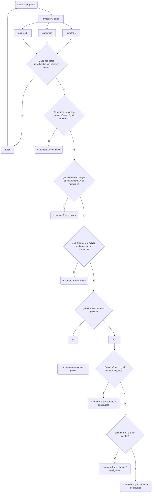
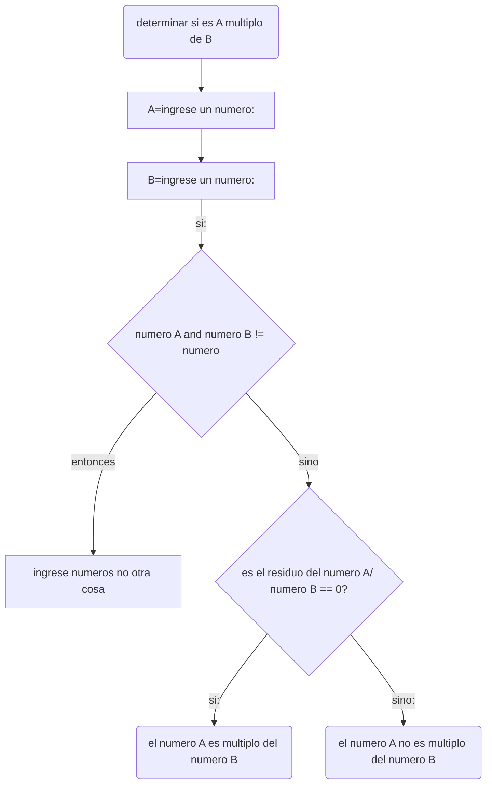
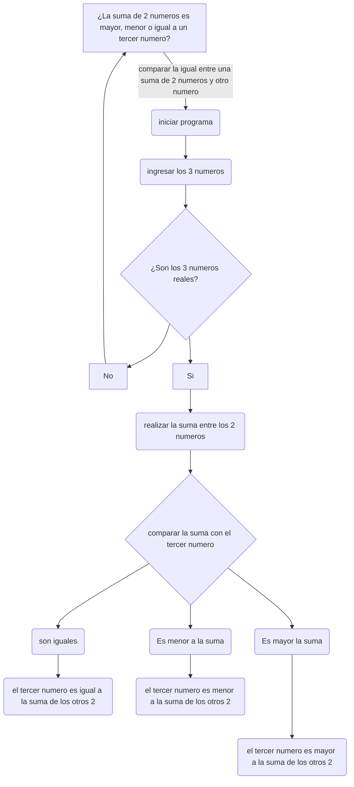

[](https://postimg.cc/dhJz99w3)
-----------------------
# Taller 1

### INTEGRANTES:

- Kevin Javier Gonzalez Luna
- Ivan Felipe Maluche
- Davin Montes
  
1.Realice el quiz Python Beginner Quiz (20 preguntas) y adjunte pantallazo con el resultado (mínimo 90% bien).
-----------------------
**-Kevin Gonzalez:**
[](https://postimg.cc/dhDQLT9f)

**-David Montes:**


[](https://postimg.cc/JGLhns3R)

**-Ivan Maluche:**


2.Realice un programa que lea tres números reales y determine cuál es el mayor.
-----------------------
```python
def checkfloat(numero):
    try:
        float(numero)
        return True
    except:
        return False

if __name__ == "__main__":

        
        numero1 = input("Ingrese el primer número: ") 
        numero2 = input("Ingrese el segundo número: ")
        numero3 = input("Ingrese el tercer número: ")
        if checkfloat(numero1) == False or checkfloat(numero2) == False or checkfloat(numero3) == False:
            print("Error, los valores ingresados no son numeros")
            exit()
        else:
            numero1 = float(numero1)
            numero2 = float(numero2)
            numero3 = float(numero3)

        if numero1 > numero2 and numero1 > numero3:
            print("El primer numero es el mayor")
        elif numero2 > numero1 and numero2 > numero3:    
            print("El segundo numero es el mayor")
        elif numero3 > numero1 and numero3 > numero2:
         print("El tercer numero es el mayor")
        else:
            if numero1 == numero2 and numero1 == numero3:
                print("Hay un empate entre los tres numeros")
            elif numero1 == numero2:
                print("Hay un empate entre el primer y segundo numero")
            else:
                print("Hay un empate entre el primer y tercer numero")

EXPLICACION:
# se ingresan los 3 numeros y se comprueba si los valores ingresados sean numeros, y al comprobar que son numeros convierte el string del input en un float
# comprueba que el numero 1 es mayor al 2 y al numero 3, si lo es imprime en la consola que el numero uno es mayor
    # si pasa el primer if, pasa al elif y comprueba ahora que el numero 2 sea mayor al 1 y al 3, si lo es imprime que el numero 2 es el mayor
        #si pasa al siquiente elif, solo queda el numero 3 a verificar que sea mayor a los otros 2  y se imprime que el numero 3 es el mayor
            #el else es un añadido que verifica si los numeros son iguales o hay un empate entre dos numeros y te dice cuales son


```
3.Realice un programa que lea un número enteros y determine si es par o impar.
-----------------------
```python
x = int(input("(numero chistoso1)x:")) #numero entero
if x/2 == x//2:
    print ("este numero es par")
else:
    print("este numero no es par")
EXPLICACION
#El usuario debe ingresar el numero entero por teclado
# El condicional compara la division con la divison exacta, esto para comprobar que la division no deja ningun residuo
# Si es asi entonces podemos deducir que es par, pues todo numero par al dividirlo entre 2 dara un entero
# Si no es asi automaticamente asumiremos que no es par 
```

4.Realice un programa que lea dos números reales y determine si el primero es múltiplo del segundo.
-----------------------
```python
def checkfloat(numero):
    try:
        float(numero)
        return True
    except:
        return False

if __name__ == "__main__":
    
    numero1 = input("Ingrese el primer número: ")
    numero2 = input("Ingrese el segundo número: ")

    if checkfloat(numero1) == False or checkfloat(numero2) == False:
        print("Error, los valores ingresados no son numeros")
        exit()
    else: 
        numero1 = float(numero1)
        numero2 = float(numero2)

    if numero1 % numero2 == 0:
        print("El numero es multiplo del segundo numero")
    else:
        print("El primer numero no es multiplo del segundo numero")

#EXPLICACION:
#primero se ingresan los dos numeros a verificar si el primero es multiplo del segundo
#el programa verifica que sean numeros, si los son convierte el string del input en un float
#el programa verifica si el residuo de la division del numero1 % numero2 == 0, si lo es: el primero es multiplo del segundo numero , sino:
    #pasa al else e imprime en la consola que el primer numero no es multiplo del segundo numero

```
5.Realice un programa que lea tres números reales y determine si la suma de los dos primeros es mayor, menor o igual que el tercer número.
-----------------------
El programa solicita la introducción de tres números reales(a través de la función is.digit y la función in, puede distinguir si la cadena ingresada es válida o no), si todas las cadenas ingresadas son válidas, todas las cadenas se transforman en variables de tipo "float" y se suman las primeras dos variables(declaradas como "a" y "b"), dando como resultado la variable "e", si la variable "e" es menor que el número 3(declarado "c"), se juzga a la suma de "a" y "b" como menor que "c", sino, se evalua si "e" es mayor que "c", si este es el caso, se juzga a la suma a+b como mayor que "c", si este no es el caso, significa que "e" y "c" son iguales, por lo que a+b=c. Si alguna de las cadenas ingresadas no es válida, el programa se finaliza con un mensaje de error.
```python
na= input("Introduzca el primer número real ")
nb= input("Introduzca el segundo número real ")
nc= input("Introduzca el tercer número real ")
if (('-' in na) or ('.' in na)) or na.isdigit():
    a: float
    a=(float(na))   
    if (('-' in nb) or ('.' in nb))or nb.isdigit():
        b: float
        b=(float(nb))
        if (('-' in nc) or ('.' in nc))or nc.isdigit():  
            c: float
            c=(float(nc))  
            e:float 
            e=a+b
            if(e<c):
                print("la suma de", a, "y", b ," es menor que", c)
            elif (e>c):
                print("la suma de", a, "y", b ," es mayor que", c)
            else:
                print("la suma de", a, "y", b ," es igual a", c)
        else:
            print(" introduzca solo números reales")
    else:
        print(" introduzca solo números reales")
else:
    print(" introduzca solo números reales")

```
6.Escriba un programa que solicite al usuario una letra y determine si es una vocal o una consonante.
-----------------------


```python
if __name__ == '__main__':
    letra = input("Ingrese una letra: ") 
    
    if len(letra) > 1: 
        letra = input("ingrese solo una letra: ")  
    elif letra.isalpha == False: 
        letra = input("ingrese solo letras(A-Z sin acento): ")
    else:
        if ord(letra) ==  (65 or 69 or 73 or 79 or 85 or 97 or 101 or 105 or 111 or 117): 
            print("Es una vocal")
        else:  
            print("Es una consonante")

#EXPLICACION:
#primero se ingresa la letra a revisar si es vocal o es consonante
#se verifica que solo entre una letra y luego se verifica que no tiene acento ya que en ingles no existen pero en español si :c, si tiene acento te especifica que no coloques acentos >:c
#al pasar la "verificacion"conprueba que es una de los posibles numeros ASCII que pertenecen a una vocal
#si no es vocal cae en el else y se imprime que es constante
            
```
7.Escriba un programa que pida 5 números reales y calcule las siguientes operaciones:
-----------------------
#### -El promedio
#### -La mediana
#### -El promedio multiplicativo (multilplica todos y luego calcula la raíz de la cantidad de operandos)
#### -Ordenar los números de forma ascendente
#### -Ordenar los números de forma descendente
#### -La potencia del mayor número elevado al menor número
#### -La raíz cúbica del menor número


```python
a:float= float(input("(numero1)a:"))
b:float= float(input("(numero1)b:"))
c:float= float(input("(numero1)c:"))
d:float= float(input("(numero1)d:"))
e:float= float(input("(numero1)e:"))

ordenado={a,b,c,d,e}
longitud=sorted(ordenado)
index= len(longitud)//2
media=(a+b+c+d+e)/5

if len(ordenado) % 2 != 0:
        print("la mediana es "+ str(longitud[index]))
promedio_multiplicativo=(a*b*c*d*e)**0.2

lista_inversa=sorted(ordenado,reverse=True)

M:float=max(ordenado)
m:float=min(ordenado)
potencia1=M**m
raiz1=m**0.33333333333333333333333333333333
print("la media es "+ str(media))
print("el promedio multiplicativo es "+ str(promedio_multiplicativo))
print(str(longitud)+ "(el conjunto en orden ascendente)")
print(str(lista_inversa) +"(el conjunto en orden descendente)")
print("la potencia numero menor del numero mayor es " +str(potencia1))
print("raiz cubica del numero menor " + str(raiz1))
EXPLICACION
# Con la media es tan facil como dividir la suma de todos los numeros entre 5, pues en este caso esa siempre sera la cantidad de numeros que usemos
# Con la mediana es necesario adentrar estos numeros en un conjunto, ordenandolo con "sorted" y encontrar el valor en el medio con ayuda de un index que represente al dato del medio dentro del conjunto ya ordenado
# El promedio multiplicativo al igual que el promedio comun es solamente multiplicar todos los valores entre si y despues potenciarlo por 0.2(1/5) a falta de una raiz
# para el conjunto ordenado ascendente solamente debemos de tomar el conjunto ordenado obtenido en la mediana
# para el descendente es necesario volver a ordenar el conjunto pero volviendo la variable reversa verdadera
# por ultimo para la potencia y raiz usando el numero mayor y menor usando "min" y "max" para que el programa identifique el numero mayor y menor del conjunto, aplicando estos en operaciones (numero mayor potenciado al menor y raiz cubica del numero menor)

```
8.Escriba un programa al que se le ingrese la frecuencia de una onda en hz y como salida arroje en que parte del espectro electromagnético se encuentra.
-----------------------
```python

def checkfloat(numero):
    try:
        float(numero)
        return True
    except:
        return False

def longitud_de_onda(frecuencia):
    c = 3 * 10**8
    longitud_de_onda = c / frecuencia
    if longitud_de_onda < 1e-11:
        return "Rayos gamma"
    elif longitud_de_onda < 1e-8:
        return "Rayos X"
    elif longitud_de_onda < 4e-7:
        return "Espectro visible"
    elif longitud_de_onda < 7e-7:
        return "Ultravioleta"
    elif longitud_de_onda < 1e-3:
        return "Infrarrojo"
    else:
        return "Ondas de radio"

if __name__ == "__main__":
    frecuencia = float(input("Ingrese la frecuencia de la onda en Hz: "))
    if frecuencia < 0:
        print("La frecuencia no puede ser negativa")
        exit()
    elif checkfloat(frecuencia) == False:
        print("Error, los valores ingresados no son numeros")
        exit()
    else:
        print("La longitud de onda de la frecuencia ingresada se encuentra en el espectro: ", longitud_de_onda(frecuencia)) 
        
```
9.Escriba un programa que reciba el nombre en minúsculas de un país de America y retorne la ciudad capital, si el país no pertenece al continente debe arrojar país no identificado.
-----------------------
El programa solicita una cadena, determinando al usuario unas reglas que debe tener la cadena introducida. Al utilizar un "match-case" el programa evaluará e imprimira la capital correspondiente de cada país. Si no se siguen las reglas establecidas, el programa arrojara un mensaje de error, se detendrá y pedirá volver a ser iniciado.
```python
print("este programa le enseñará el nombre de la capital de los paises de América:")
P= input("Escriba un país de América(en minúsculas y con buena otrografía)"
         "para saber cual es su capital:")
match(P):
    case "antigua y barbuda":
        print("la capital del pais",'"',P,'"',"(en minúsculas) es: saint john's")
    case "argentina":
        print("la capital del pais",'"',P,'"',"(en minúsculas) es: buenos aires")
    case "bahamas":
        print("la capital del pais",'"',P,'"',"(en minúsculas) es: nasáu")
    case "barbados":
        print("la capital del pais",'"',P,'"',"(en minúsculas) es: bridgetown")
    case "belice":
        print("la capital del pais",'"',P,'"',"(en minúsculas) es: belmopán")
    case "bolivia":
        print("la capital del pais",'"',P,'"',"(en minúsculas) es: sucre")
    case "brasil":
        print("la capital del pais",'"',P,'"',"(en minúsculas) es: brasilia")
    case "canadá":
        print("la capital del pais",'"',P,'"',"(en minúsculas) es: ottawa")
    case "chile":
        print("la capital del pais",'"',P,'"',"(en minúsculas) es: santiago")
    case "colombia":
        print("la capital del pais",'"',P,'"',"(en minúsculas) es: bogotá")
    case "costa rica":
        print("la capital del pais",'"',P,'"',"(en minúsculas) es: san josé")
    case "cuba":
        print("la capital del pais",'"',P,'"',"(en minúsculas) es: la habana")
    case "dominica":
        print("la capital del pais",'"',P,'"',"(en minúsculas) es: roseau")
    case "ecuador":
        print("la capital del pais",'"',P,'"',"(en minúsculas) es: quito")
    case "el salvador":
        print("la capital del pais",'"',P,'"',"(en minúsculas) es: san salvador")
    case "estados unidos":
        print("la capital del pais",'"',P,'"',"(en minúsculas) es: washington d. c.")
    case "granada":
        print("la capital del pais",'"',P,'"',"(en minúsculas) es: saint george")
    case "guatemala":
        print("la capital del pais",'"',P,'"',"(en minúsculas) es: ciudad de guatemala")
    case "guyana":
        print("la capital del pais",'"',P,'"',"(en minúsculas) es: georgetown")
    case "haití":
        print("la capital del pais",'"',P,'"',"(en minúsculas) es: puerto príncipe")
    case "honduras":
        print("la capital del pais",'"',P,'"',"(en minúsculas) es: tegucigalpa")
    case "jamaica":
        print("la capital del pais",'"',P,'"',"(en minúsculas) es: kingston")
    case "méxico":
        print("la capital del pais",'"',P,'"',"(en minúsculas) es: ciudad de méxico")
    case "nicaragua":
        print("la capital del pais",'"',P,'"',"(en minúsculas) es: managua")
    case "panamá":
        print("la capital del pais",'"',P,'"',"(en minúsculas) es: ciudad de panamá")
    case "paraguay":
        print("la capital del pais",'"',P,'"',"(en minúsculas) es: asunción")
    case "perú":
        print("la capital del pais",'"',P,'"',"(en minúsculas) es: lima")
    case "república dominicana":
        print("la capital del pais",'"',P,'"',"(en minúsculas) es: santo domingo")
    case "san cristóbal y nieves":
        print("la capital del pais",'"',P,'"',"(en minúsculas) es: basseterre")
    case "san vicente y las granadinas":
        print("la capital del pais",'"',P,'"',"(en minúsculas) es: kingstown")
    case "santa lucía":
        print("la capital del pais",'"',P,'"',"(en minúsculas) es: castries")
    case "surinam":
        print("la capital del pais",'"',P,'"',"(en minúsculas) es: paramaribo")
    case "trinidad y tobago":
        print("la capital del pais",'"',P,'"',"(en minúsculas) es: puerto españa")
    case "uruguay":
        print("la capital del pais",'"',P,'"',"(en minúsculas) es: montevideo")
    case "venezuela":
        print("la capital del pais",'"',P,'"',"(en minúsculas) es: caracas")
    case _:
        print("Usted no ha introducido el nombre de ningún país de américa"
               " siguiendo las indicaciones dadas, por favor intente de nuevo.")
```
10.Escriba un programa que dada una distancia calcule:
-----------------------
#### -El tiempo que le tomaría a la luz recorrer la distancia.
#### -El tiempo que le tomaría al sonido (en el aire) recorrer la distancia.
#### -El tiempo que le tomaría al vehiculo comercial más veloz recorrer la distancia.
#### -El tiempo que le tomaría a Bolt recorrer la distancia.
```python
def checkfloat(numero):
    try:
        float(numero)
        return True
    except:
        return False

if __name__ == "__main__":

    distancia = float(input("Ingrese una distancia en metros: ")) # D = v * t -> t = D / v
    if distancia < 0:
        print("La distancia no puede ser negativa")
        exit()
    elif checkfloat(distancia) == False:
        print("Error, los valores ingresados no son numeros")
        exit()
    else:
        tiempoLuz = distancia / 299792458
        print("el tiempo que tarda en recorer la distancia la luz es: ", tiempoLuz, "segundos")
        tiempoSonido = distancia / 343
        print("el tiempo que tarda en recorer la distancia el sonido es: ", tiempoSonido, "segundos")
        tiempoCarroMasVeloz = distancia / 136
        print("el tiempo que tarda en recorer la distancia el carro mas veloz es: ", tiempoCarroMasVeloz, "segundos")
        tiempoBolt = distancia / 10.43
        print("el tiempo que tarda en recorer la distancia Usain Bolt es: ", tiempoBolt, "segundos")

#EXPLICACION:
#primero defino los valores que piden los transformo a metros sobre segundos y luego si voy al codigo
#el programa "pide" que ingrese una distancia en metros y luego verifica que sea una distancia positiva y que sea un numero
# T= D/V con esa formula para cada tiempo a calcular (luz,sonido, el carro, y ussain bolt), como distancia usa la del input y la velocidad la que defini al inicio
#el programa imprime cuanto tiempo tarda cada cosa en recorrer la distancia

```
-----------------------
# DIAGRAMAS
-----------------------
### -ejercicio 2 - DAVID MONTES
El respectivo diagrama de flujo:

### -ejercicio 4 - KEVIN GONZALEZ


### -ejercicio 5 - IVÁN MALUCHE


link al video en el cual se explica el punto 5:
[]([https://www.youtube.com/watch?v=bBYBskhDXr8&ab_channel=DavidsIdee)
